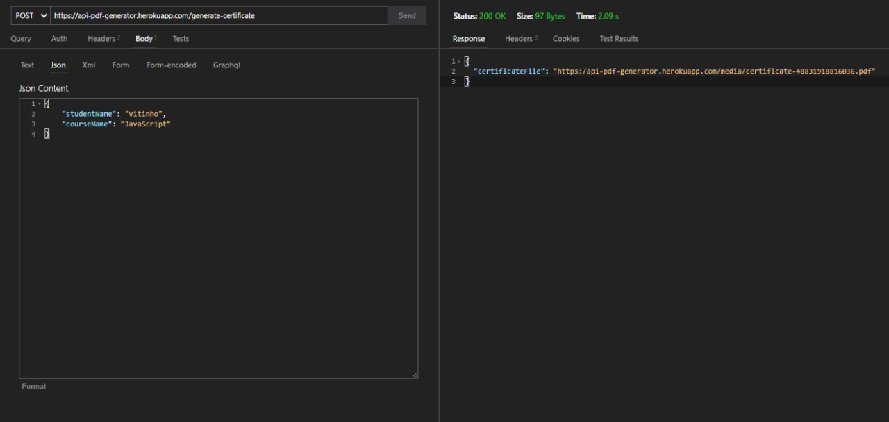
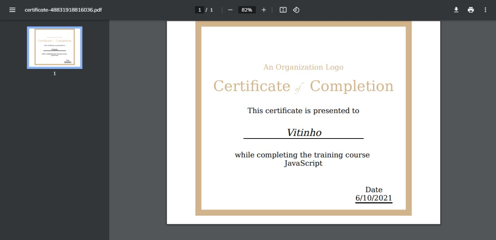

# Certificate of Conclusion Generator

## Challenge
"A idéia é construir um serviço WEB que receba um modelo em HTML do certificado e os dados do aluno e gerar um arquivo PDF desse certificado." [Learn more](https://gist.github.com/cmilfont/2a194a6759944a36a4a5b401f403ff42#servi%C3%A7o-web-para-gera%C3%A7%C3%A3o-de-certificados-de-conclus%C3%A3o-de-curso)

## Usage:

<br />

Click: [Endpoint](https://api-pdf-generator.herokuapp.com) 

Or Access: [https://api-pdf-generator.herokuapp.com](https://api-pdf-generator.herokuapp.com) 

( If does not Work try Copy and Paste )

<br />

## Routes:

```JSON
  "Endpoint": "/generate-certificate",
  "Method": "POST",
  "Body": {
    "studentName": "String",
    "courseName": "String"
  },
  "Response": {
    "certificateFile": "Your Certificate file URL"
  }
```
<br />
<br />

## Samples:
<br />

### Simple Usage Sample:


<br />

### Follow the Response URL you can see a File like This:

<small>This is your Certificate 😘🎉</small>